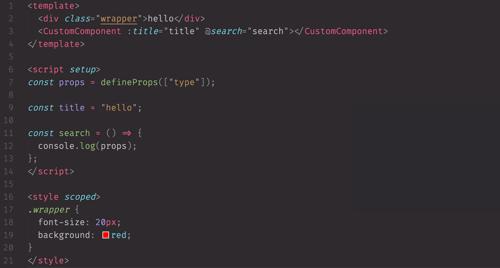
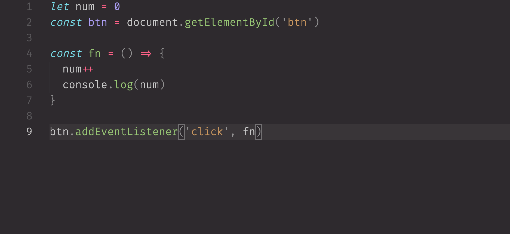

# 🎨 Monokai Pro Muted — 低亮度护眼配色方案

> **Monokai Pro 主题亮度降低版** · 柔和护眼 · Low Contrast · Muted Color Scheme for VS Code

---

**English** | [中文](#-简介)

A customized VS Code color configuration based on the official **Monokai Pro** theme.  
It **reduces code highlight brightness** and **lowers contrast**, making the overall color palette softer and more comfortable for long hours of coding.

### ✨ Features

- Retains the classic Monokai Pro style and structure
- Reduces highlight brightness to ease eye strain
- Low saturation, low contrast — ideal for developers who prefer muted colors
- Works seamlessly with the original Monokai Pro theme

### 📦 Usage

1. Open VS Code settings (`settings.json`)
2. Copy the configuration from this repo's `settings.json` into your own
3. Select `Monokai Pro` as your color theme — the muted colors take effect automatically

### 📸 Preview

| Vue | JavaScript |
|-----|-----------|
|  |  |

---

## 📖 简介

本项目是基于 VS Code 官方 **Monokai Pro** 主题的**自定义调色配置**。  
核心思路是**降低代码高亮颜色的亮度与饱和度**，让整体观感更柔和，减轻长时间编码的眼部疲劳。

### 🎯 适用人群

- 觉得 Monokai Pro 原生配色太亮的开发者
- 喜欢低饱和度、低对比度护眼配色的程序员
- 需要长时间阅读代码、希望减少视觉刺激的用户

### 🚀 快速开始

1. 打开 VS Code，按 `Cmd+Shift+P` (Mac) / `Ctrl+Shift+P` (Win) 打开命令面板
2. 输入 `Preferences: Open Settings (JSON)` 打开 `settings.json`
3. 将 [`settings.json`](settings.json) 中的内容复制进去并保存
4. 选择 `Monokai Pro` 主题即可看到柔化效果

> 💡 本配置不会覆盖 Monokai Pro 主题结构，仅调整颜色数值，随时可以删除恢复原样。

### 🔍 相关搜索关键词

`VS Code 主题调暗` · `Monokai Pro 降低亮度` · `代码配色柔和` · `护眼主题` · `低对比度` · `Monokai muted` · `vscode low contrast theme` · `eye strain reduction` · `muted color scheme vscode`
